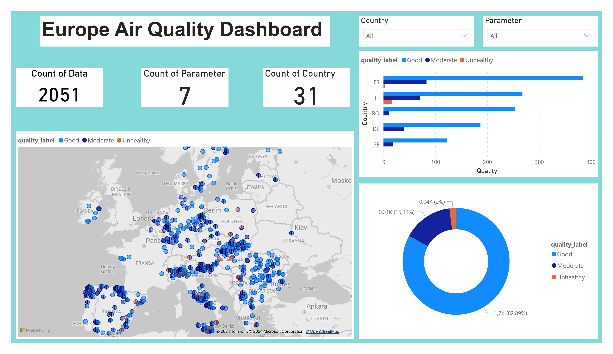

# Air Quality Analysis

This project aims to analyze air quality data obtained from the OpenAQ API. The process involves retrieving air quality data from the OpenAQ website using their API, cleaning and organizing the data, labeling it into categories such as 'good', 'moderate', and 'unhealthy', analyzing the data using SQL queries with SQLite 3, and finally, creating a dashboard using Power BI.

## Project Overview

The project follows these steps:

Data Collection: Air quality data is fetched from the OpenAQ API.
Data Cleaning and Labeling: The retrieved data is cleaned and organized, and labels such as 'good', 'moderate', and 'unhealthy' are assigned based on air quality standards.
Data Analysis: SQLite 3 and SQL queries are utilized to perform in-depth analysis on the data, extracting valuable insights.
Dashboard Creation: A dashboard is created using Power BI, incorporating various visualizations such as pie charts, world maps, etc., to present the analyzed data in an easily understandable format.
  
## Screenshots

  
## License

  